# SpringWebNews 処理フロー

[[ <u>目次へ戻る</u> ]](../../README.md#-フロー図-ファイル一式-)

---

 

## ● 処理フロー一覧

[**＜ 1 ＞ 全体概要**](#1-全体概要)

[**＜ 2 ＞ ログイン・ログアウトフロー**](#2-ログインログアウトフロー)

[**＜ 3 ＞ トップ画面作成フロー**](#3-トップ画面作成フロー)

[**＜ 4 ＞ ニュース一覧作成フロー**](#4-ニュース一覧作成フロー)

[**＜ 5 ＞ ニュース詳細表示フロー**](#5-ニュース詳細表示フロー)

[**＜ 6 ＞ お気に入り・Good・Bad リアクション処理フロー**](#6-お気に入りgoodbad-リアクション処理フロー)

[**＜ 7 ＞ 閲覧・操作履歴記録フロー（短時間重複防止）**](#7-閲覧操作履歴記録フロー短時間重複防止)

[**＜ 8 ＞ 推薦ニュース表示フロー**](#8-推薦ニュース表示フロー)

[**＜ 9 ＞ マイページ・パスワード変更フロー**](#9-マイページパスワード変更フロー)

[**＜ 10 ＞ ユーザー管理フロー**](#10-ユーザー管理フロー)

[**＜ 11 ＞ ニュース・カテゴリ管理フロー**](#11-ニュースカテゴリ管理フロー)

[**＜ 12 ＞ ハッシュタグ管理フロー**](#12-ハッシュタグ管理フロー)

[**＜ 13 ＞ モデル管理フロー**](#13-モデル管理フロー)

[**＜ 14 ＞ 学習機能フロー**](#14-学習機能フロー)

[**＜ 15 ＞ エラー処理フロー**](#15-エラー処理フロー)

 

―――――――――――――――――――――――――――――――

 

## 1. 全体概要

SpringWebNews は、Spring Boot / WebFlux で構成されたニュース閲覧・推薦 Web アプリケーションである。

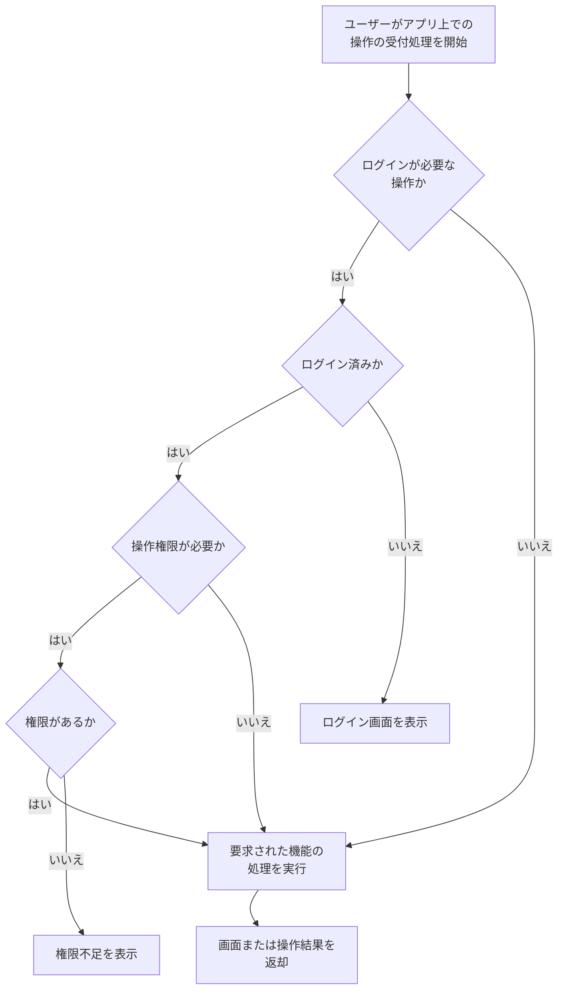

 

[[ <u>▲ ページ上部へ</u> ]](#springwebnews-処理フロー)

―――――――――――――――――――――――――――――――

 

## 2. ログイン・ログアウトフロー

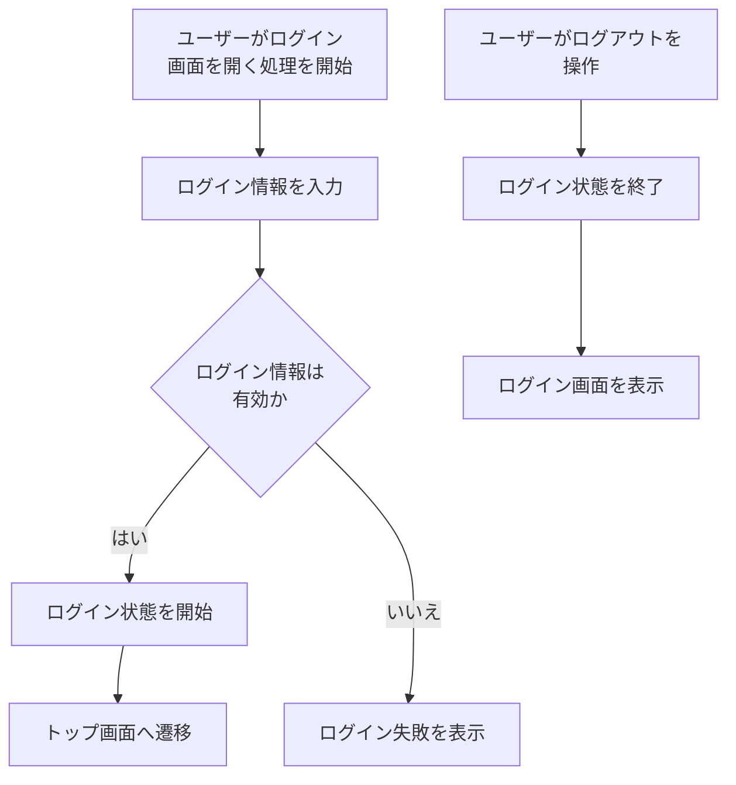

 

[[ <u>▲ ページ上部へ</u> ]](#springwebnews-処理フロー)

―――――――――――――――――――――――――――――――

 

## 3. トップ画面作成フロー

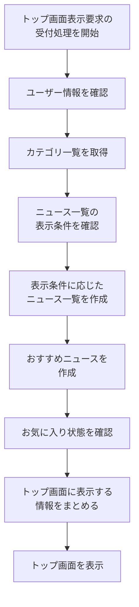

 

[[ <u>▲ ページ上部へ</u> ]](#springwebnews-処理フロー)

―――――――――――――――――――――――――――――――

 

## 4. ニュース一覧作成フロー

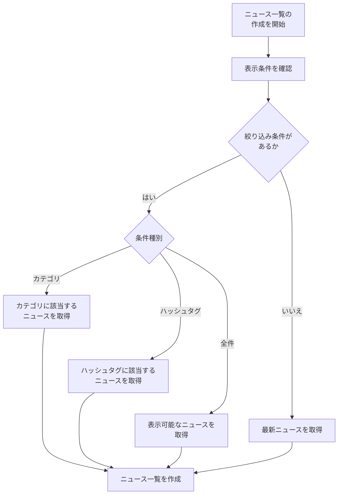

 

[[ <u>▲ ページ上部へ</u> ]](#springwebnews-処理フロー)

―――――――――――――――――――――――――――――――

 

## 5. ニュース詳細表示フロー

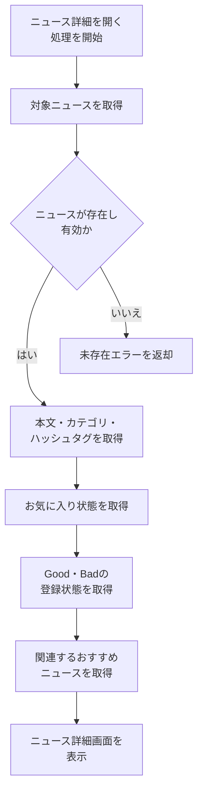

 

[[ <u>▲ ページ上部へ</u> ]](#springwebnews-処理フロー)

―――――――――――――――――――――――――――――――

 

## 6. お気に入り・Good・Bad リアクション処理フロー

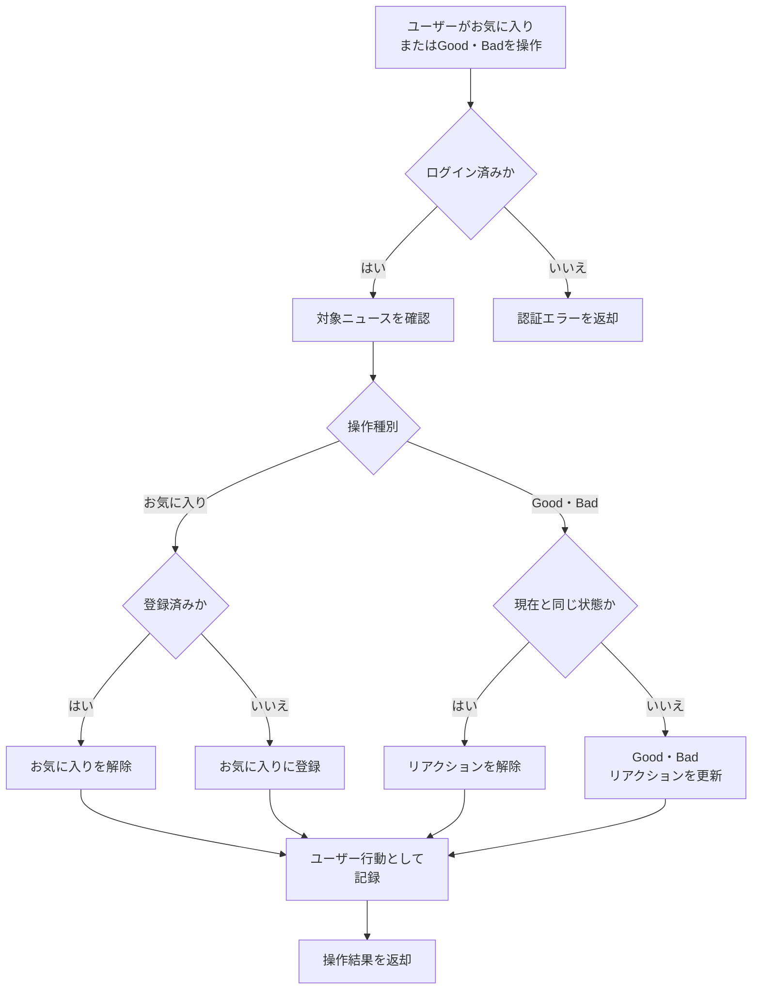

 

[[ <u>▲ ページ上部へ</u> ]](#springwebnews-処理フロー)

―――――――――――――――――――――――――――――――

 

## 7. 閲覧・操作履歴記録フロー（短時間重複防止）

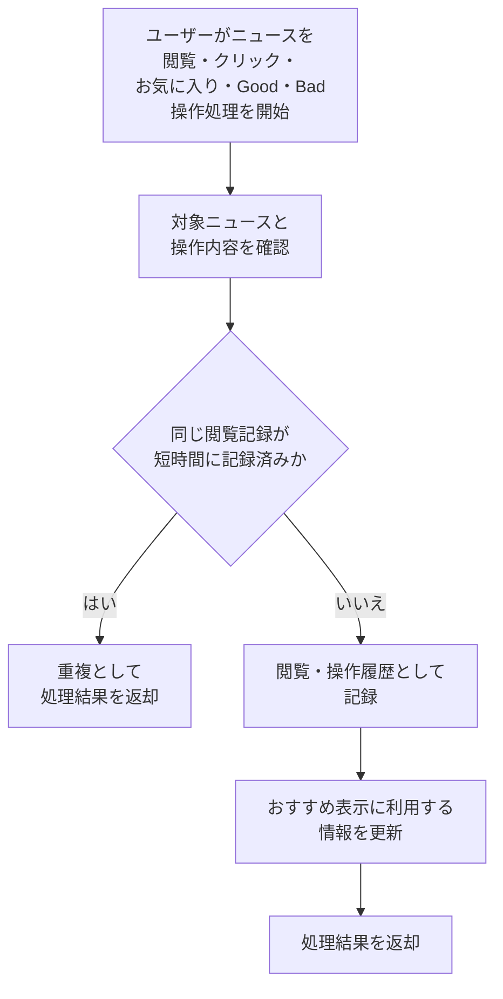

 

[[ <u>▲ ページ上部へ</u> ]](#springwebnews-処理フロー)

―――――――――――――――――――――――――――――――

 

## 8. 推薦ニュース表示フロー

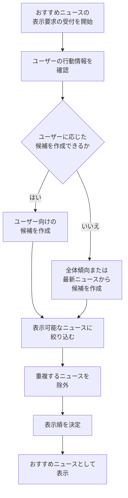

 

[[ <u>▲ ページ上部へ</u> ]](#springwebnews-処理フロー)

―――――――――――――――――――――――――――――――

 

## 9. マイページ・パスワード変更フロー

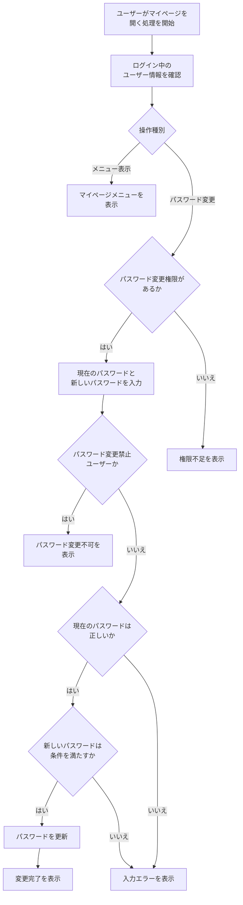

 

[[ <u>▲ ページ上部へ</u> ]](#springwebnews-処理フロー)

―――――――――――――――――――――――――――――――

 

## 10. ユーザー管理フロー

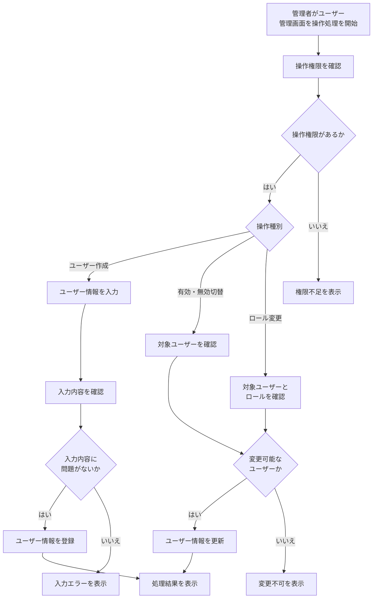

 

[[ <u>▲ ページ上部へ</u> ]](#springwebnews-処理フロー)

―――――――――――――――――――――――――――――――

 

## 11. ニュース・カテゴリ管理フロー

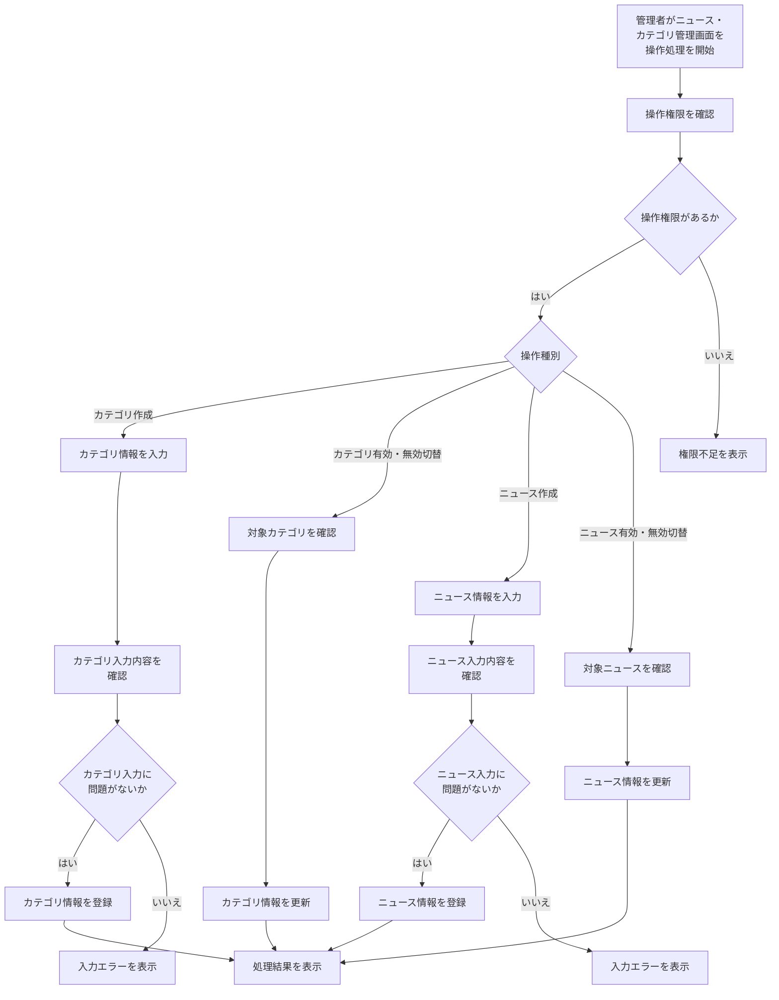

 

[[ <u>▲ ページ上部へ</u> ]](#springwebnews-処理フロー)

―――――――――――――――――――――――――――――――

 

## 12. ハッシュタグ管理フロー

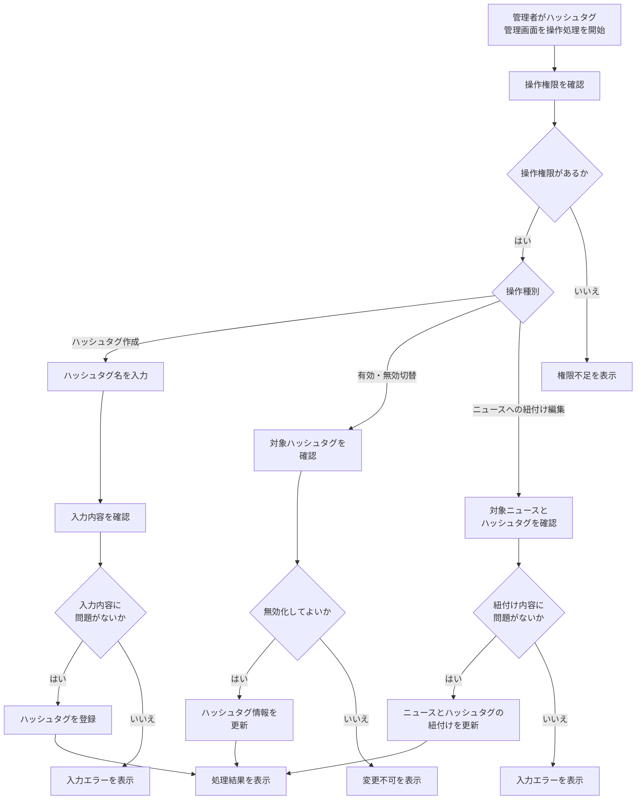

 

[[ <u>▲ ページ上部へ</u> ]](#springwebnews-処理フロー)

―――――――――――――――――――――――――――――――

 

## 13. モデル管理フロー

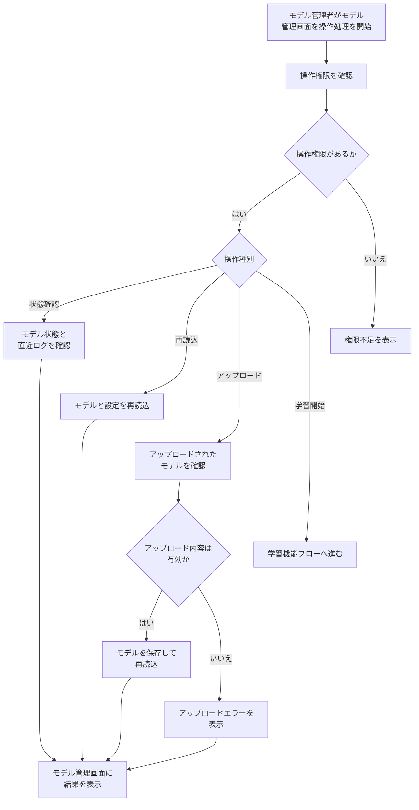

 

[[ <u>▲ ページ上部へ</u> ]](#springwebnews-処理フロー)

―――――――――――――――――――――――――――――――

 

## 14. 学習機能フロー

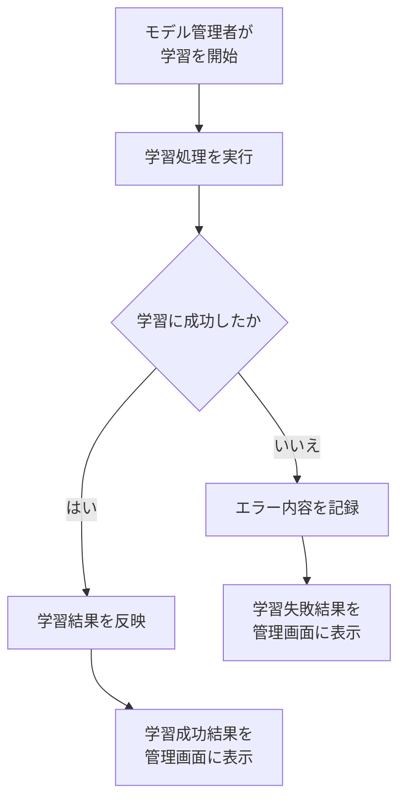

 

[[ <u>▲ ページ上部へ</u> ]](#springwebnews-処理フロー)

―――――――――――――――――――――――――――――――

 

## 15. エラー処理フロー

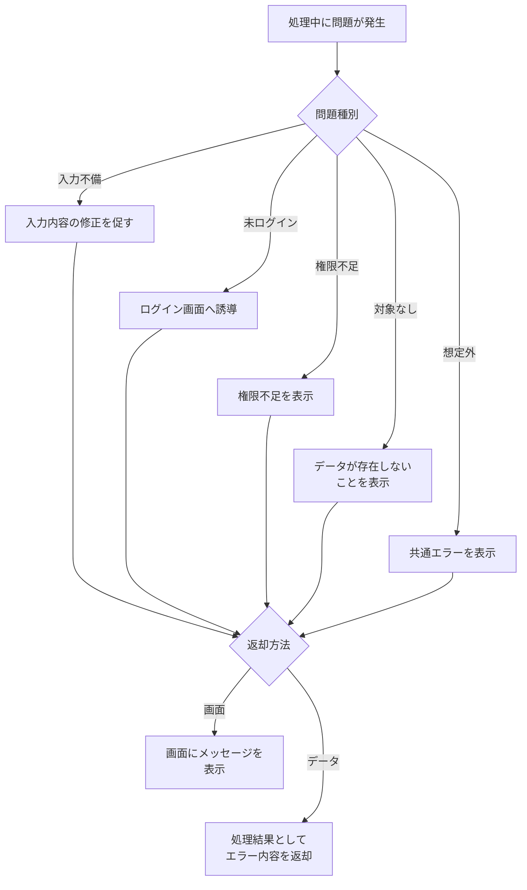

 

---

[[ <u>▲ ページ上部へ</u> ]](#springwebnews-処理フロー)

[[ <u>目次へ戻る</u> ]](../../README.md#-フロー図-ファイル一式-)
