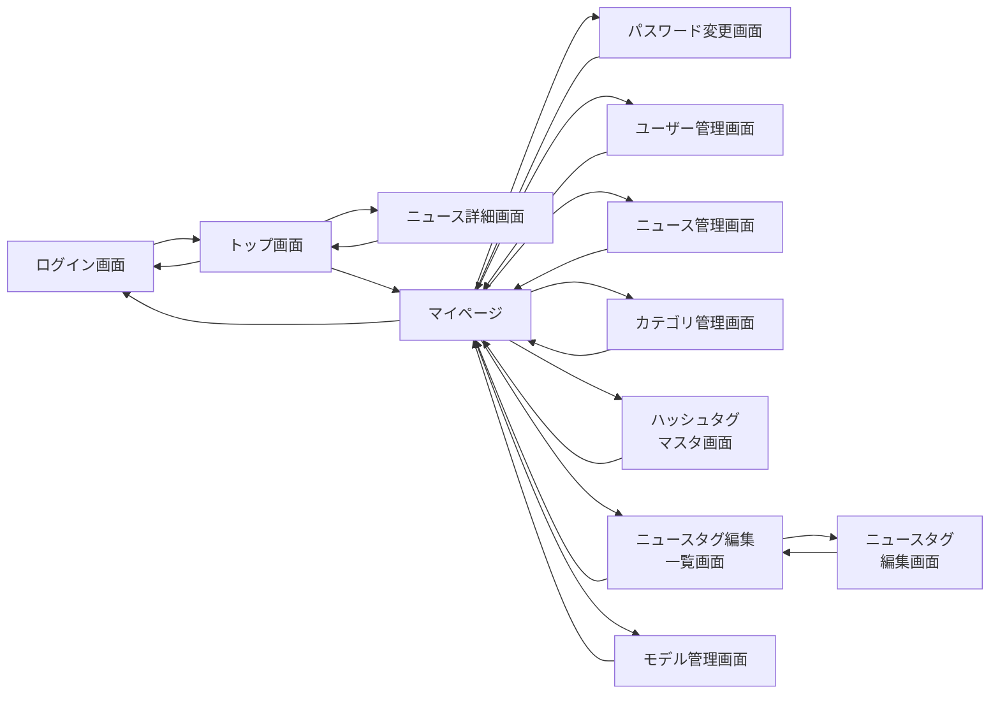
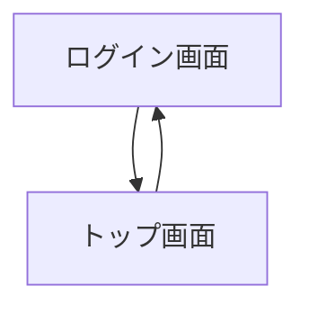
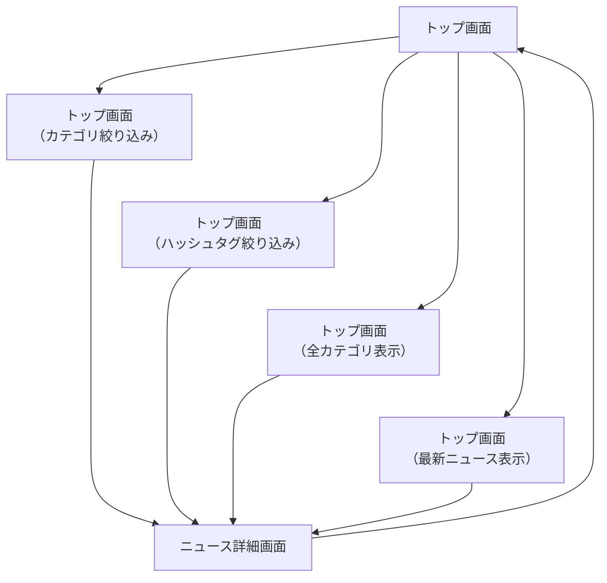
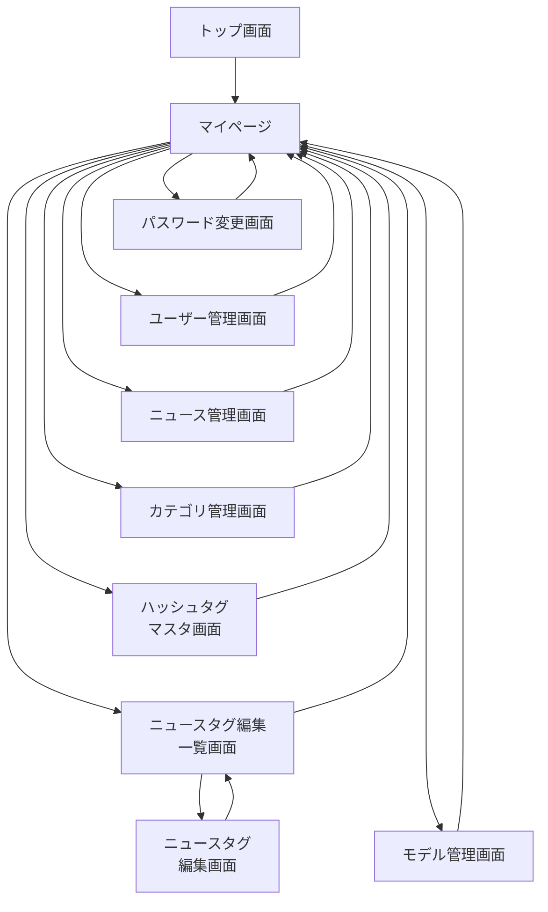
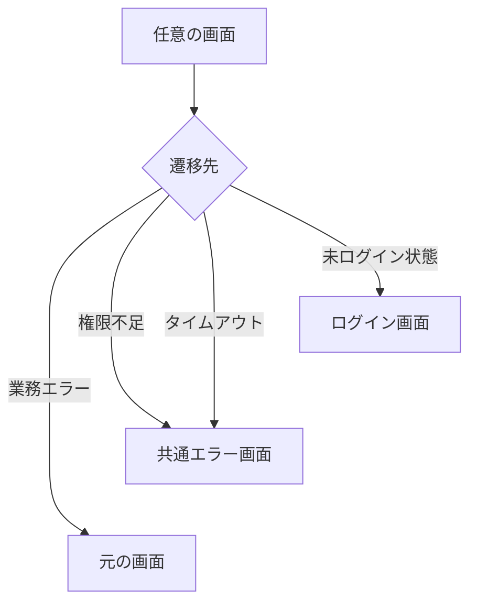

# SpringWebNews 画面遷移フロー

[[ <u>目次へ戻る</u> ]](../../README.md#-フロー図-ファイル一式-)

---

 

## ● 画面遷移フロー一覧

[**＜ 1 ＞ 画面遷移フローの全体概要**](#1-画面遷移フローの全体概要)

[**＜ 2 ＞ ログイン・ログアウトの画面遷移フロー**](#2-ログインログアウトの画面遷移フロー)

[**＜ 3 ＞ ニュース閲覧系の画面遷移フロー**](#3-ニュース閲覧系の画面遷移フロー)

[**＜ 4 ＞ マイページ系の画面遷移フロー**](#4-マイページ系の画面遷移フロー)

[**＜ 5 ＞ エラー・タイムアウトの画面遷移フロー**](#5-エラータイムアウトの画面遷移フロー)

 

―――――――――――――――――――――――――――――――

 

## 1. 画面遷移フローの全体概要

 

[[ <u>▲ ページ上部へ</u> ]](#springwebnews-画面遷移フロー)

―――――――――――――――――――――――――――――――

 

## 2. ログイン・ログアウトの画面遷移フロー

 

[[ <u>▲ ページ上部へ</u> ]](#springwebnews-画面遷移フロー)

―――――――――――――――――――――――――――――――

 

## 3. ニュース閲覧系の画面遷移フロー

 

[[ <u>▲ ページ上部へ</u> ]](#springwebnews-画面遷移フロー)

―――――――――――――――――――――――――――――――

 

## 4. マイページ系の画面遷移フロー

 

[[ <u>▲ ページ上部へ</u> ]](#springwebnews-画面遷移フロー)

―――――――――――――――――――――――――――――――

 

## 5. エラー・タイムアウトの画面遷移フロー

 

---

[[ <u>▲ ページ上部へ</u> ]](#springwebnews-画面遷移フロー)

[[ <u>目次へ戻る</u> ]](../../README.md#-フロー図-ファイル一式-)
