# SpringWebNews 推薦フロー

[[ <u>目次へ戻る</u> ]](../../README.md#-フロー図-ファイル一式-)

---

 

## ● 推薦フロー一覧

[**＜ 1 ＞ 全体概要**](#1-全体概要)

[**＜ 2 ＞ 推薦条件決定フロー**](#2-推薦条件決定フロー)

[**＜ 3 ＞ 推薦候補取得フロー**](#3-推薦候補取得フロー)

[**＜ 4 ＞ 個人候補作成フロー**](#4-個人候補作成フロー)

[**＜ 5 ＞ 全体候補作成フロー**](#5-全体候補作成フロー)

[**＜ 6 ＞ 特徴量作成フロー**](#6-特徴量作成フロー)

[**＜ 7 ＞ 推薦値算出フロー**](#7-推薦値算出フロー)

[**＜ 8 ＞ 基本評価作成フロー**](#8-基本評価作成フロー)

[**＜ 9 ＞ 再閲覧補正フロー**](#9-再閲覧補正フロー)

[**＜ 10 ＞ 推薦候補選択フロー**](#10-推薦候補選択フロー)

[**＜ 11 ＞ 推薦結果返却フロー**](#11-推薦結果返却フロー)

[**＜ 12 ＞ 推薦エラー・代替処理フロー**](#12-推薦エラー代替処理フロー)

 

―――――――――――――――――――――――――――――――

 

## 1. 全体概要

SpringWebNews の推薦候補作成、推薦値算出、候補選択、推薦結果返却までの処理を示す。

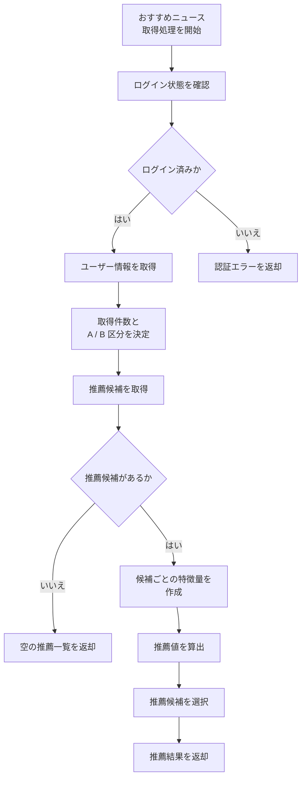

 

[[ <u>▲ ページ上部へ</u> ]](#springwebnews-推薦フロー)

―――――――――――――――――――――――――――――――

 

## 2. 推薦条件決定フロー

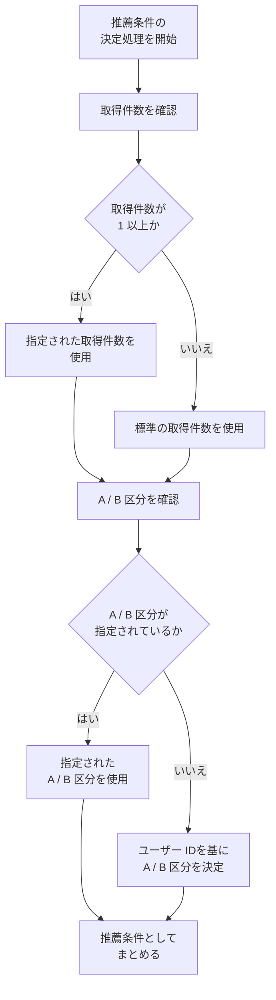

 

[[ <u>▲ ページ上部へ</u> ]](#springwebnews-推薦フロー)

―――――――――――――――――――――――――――――――

 

## 3. 推薦候補取得フロー

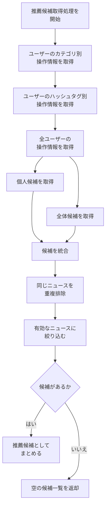

 

[[ <u>▲ ページ上部へ</u> ]](#springwebnews-推薦フロー)

―――――――――――――――――――――――――――――――

 

## 4. 個人候補作成フロー

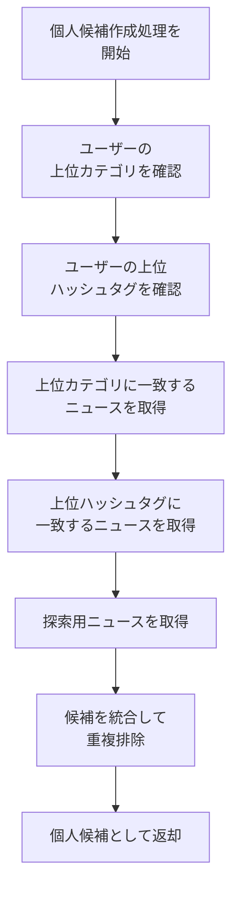

 

[[ <u>▲ ページ上部へ</u> ]](#springwebnews-推薦フロー)

―――――――――――――――――――――――――――――――

 

## 5. 全体候補作成フロー

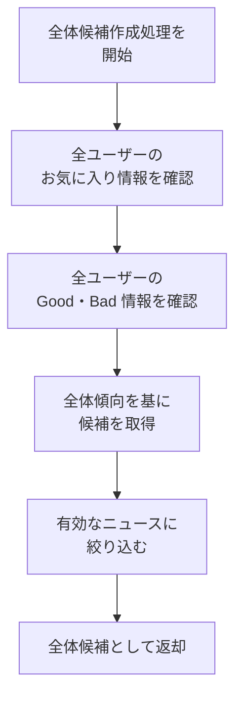

 

[[ <u>▲ ページ上部へ</u> ]](#springwebnews-推薦フロー)

―――――――――――――――――――――――――――――――

 

## 6. 特徴量作成フロー

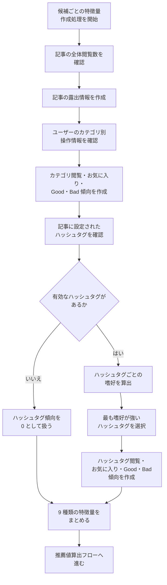

 

[[ <u>▲ ページ上部へ</u> ]](#springwebnews-推薦フロー)

―――――――――――――――――――――――――――――――

 

## 7. 推薦値算出フロー

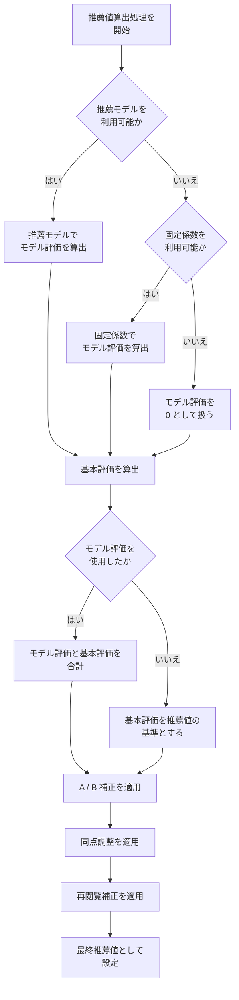

 

[[ <u>▲ ページ上部へ</u> ]](#springwebnews-推薦フロー)

―――――――――――――――――――――――――――――――

 

## 8. 基本評価作成フロー

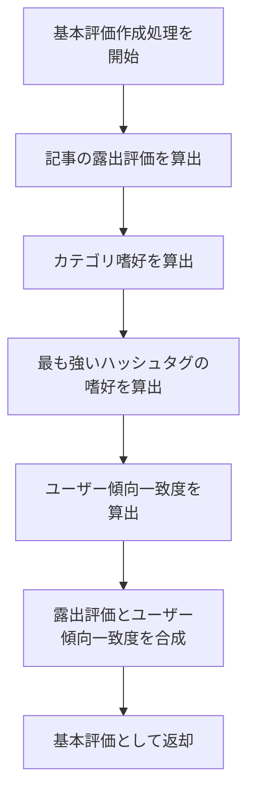

 

[[ <u>▲ ページ上部へ</u> ]](#springwebnews-推薦フロー)

―――――――――――――――――――――――――――――――

 

## 9. 再閲覧補正フロー

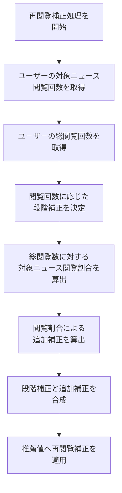

 

[[ <u>▲ ページ上部へ</u> ]](#springwebnews-推薦フロー)

―――――――――――――――――――――――――――――――

 

## 10. 推薦候補選択フロー

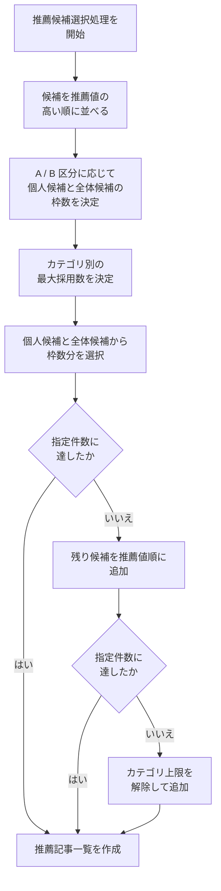

 

[[ <u>▲ ページ上部へ</u> ]](#springwebnews-推薦フロー)

―――――――――――――――――――――――――――――――

 

## 11. 推薦結果返却フロー

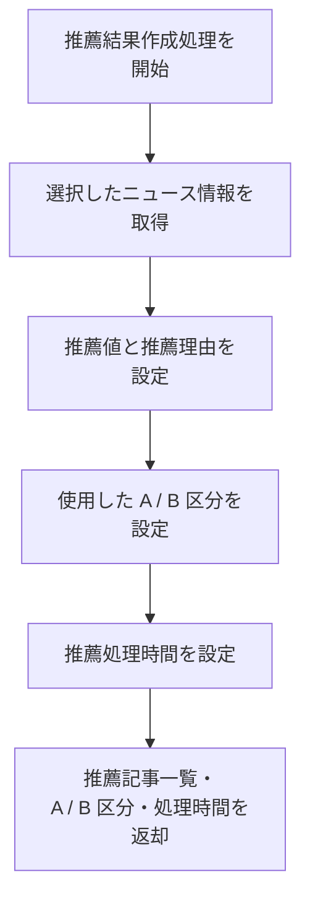

 

[[ <u>▲ ページ上部へ</u> ]](#springwebnews-推薦フロー)

―――――――――――――――――――――――――――――――

 

## 12. 推薦エラー・代替処理フロー

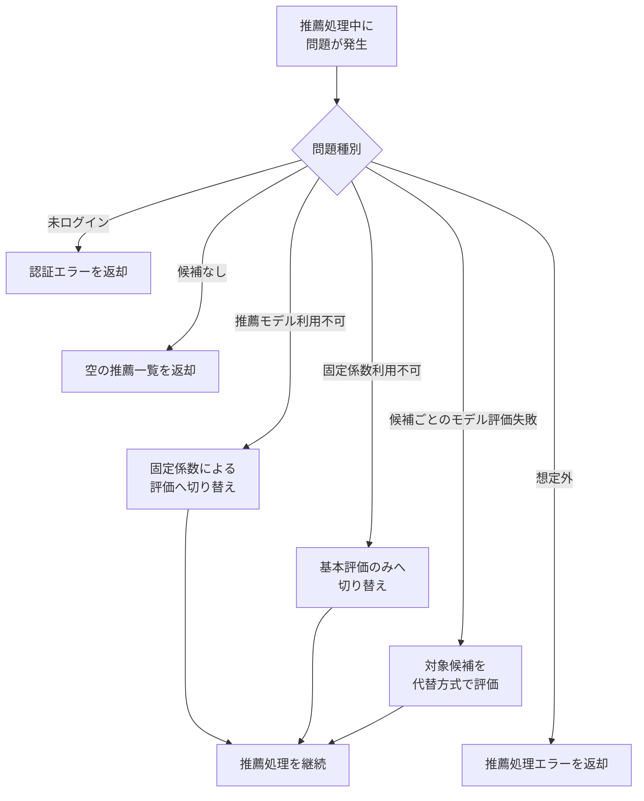

 

---

[[ <u>▲ ページ上部へ</u> ]](#springwebnews-推薦フロー)

[[ <u>目次へ戻る</u> ]](../../README.md#-フロー図-ファイル一式-)
