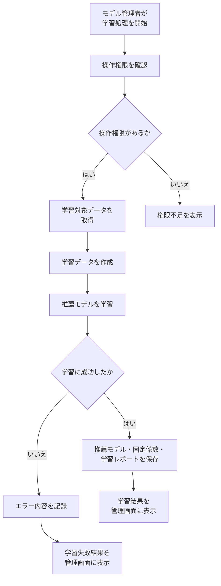
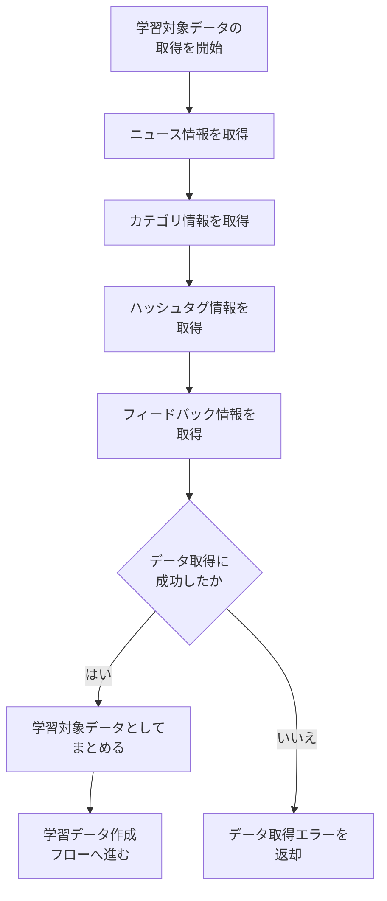
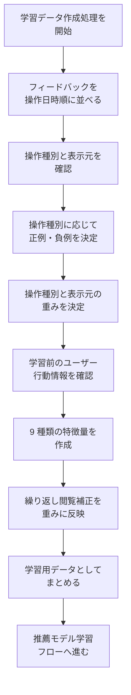
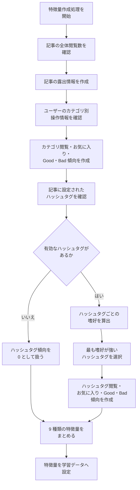
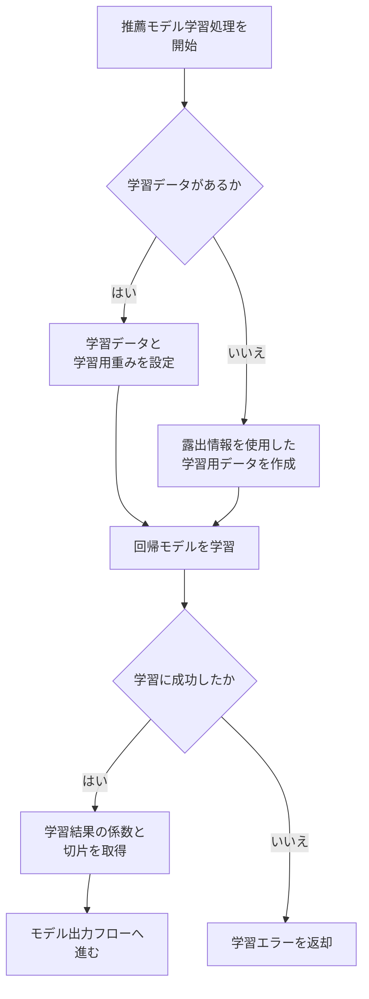
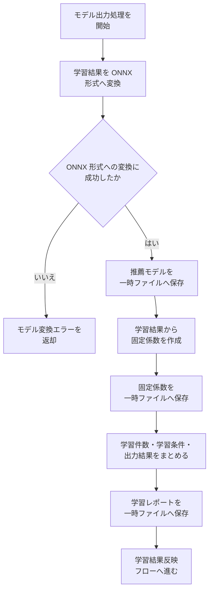
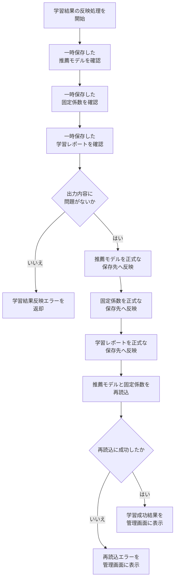
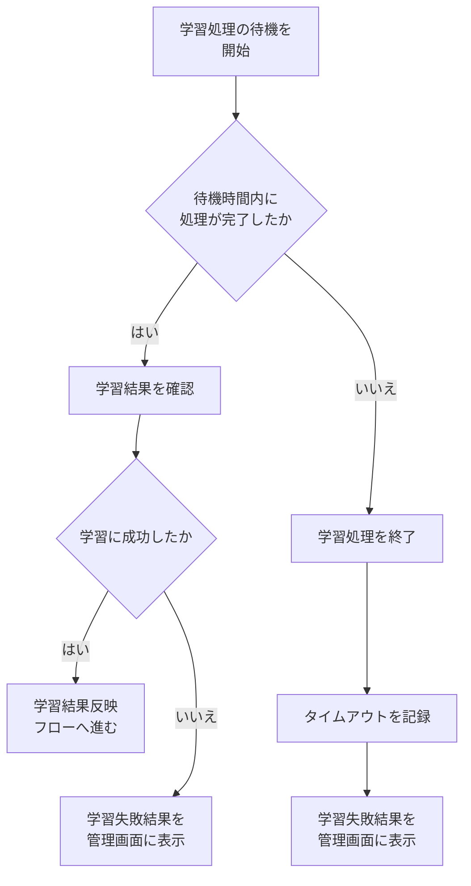
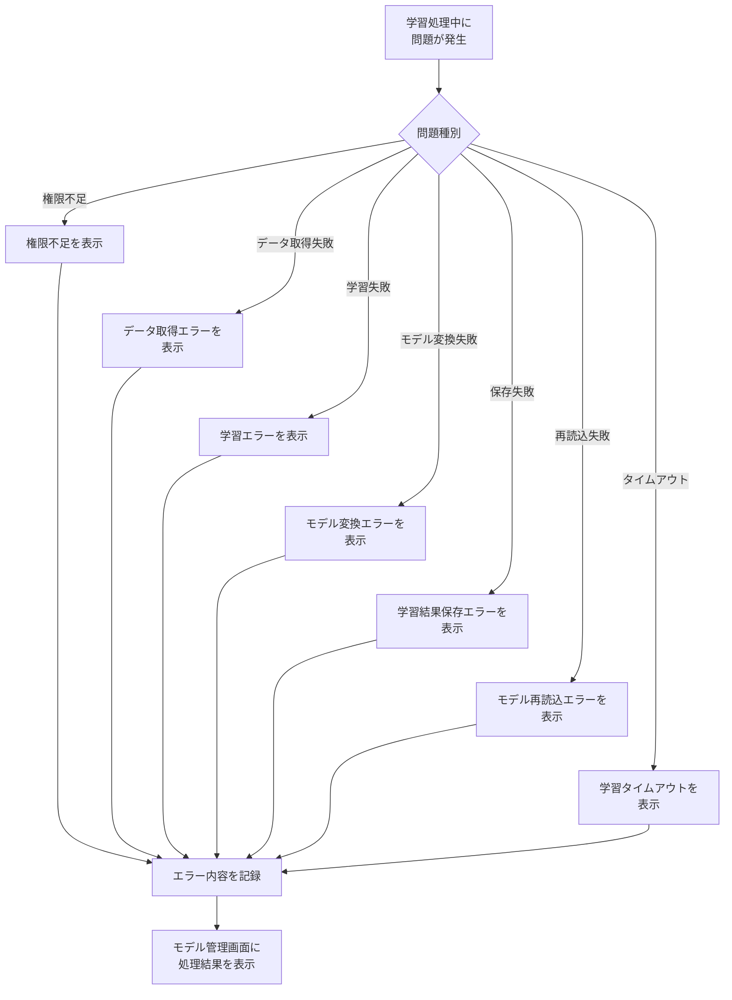

# SpringWebNews 学習モデルフロー

[[ <u>目次へ戻る</u> ]](../../README.md#-フロー図-ファイル一式-)

---

 

## ● 学習モデルフロー一覧

[**＜ 1 ＞ 全体概要**](#1-全体概要)

[**＜ 2 ＞ 学習対象データ取得フロー**](#2-学習対象データ取得フロー)

[**＜ 3 ＞ 学習データ作成フロー**](#3-学習データ作成フロー)

[**＜ 4 ＞ 特徴量作成フロー**](#4-特徴量作成フロー)

[**＜ 5 ＞ 推薦モデル学習フロー**](#5-推薦モデル学習フロー)

[**＜ 6 ＞ モデル出力フロー**](#6-モデル出力フロー)

[**＜ 7 ＞ 学習結果反映フロー**](#7-学習結果反映フロー)

[**＜ 8 ＞ 学習タイムアウトフロー**](#8-学習タイムアウトフロー)

[**＜ 9 ＞ 学習エラー処理フロー**](#9-学習エラー処理フロー)

 

―――――――――――――――――――――――――――――――

 

## 1. 全体概要

SpringWebNews の推薦モデル学習、固定係数生成、学習結果反映までの処理を示す。

 

[[ <u>▲ ページ上部へ</u> ]](#springwebnews-学習モデルフロー)

―――――――――――――――――――――――――――――――

 

## 2. 学習対象データ取得フロー

 

[[ <u>▲ ページ上部へ</u> ]](#springwebnews-学習モデルフロー)

―――――――――――――――――――――――――――――――

 

## 3. 学習データ作成フロー

 

[[ <u>▲ ページ上部へ</u> ]](#springwebnews-学習モデルフロー)

―――――――――――――――――――――――――――――――

 

## 4. 特徴量作成フロー

 

[[ <u>▲ ページ上部へ</u> ]](#springwebnews-学習モデルフロー)

―――――――――――――――――――――――――――――――

 

## 5. 推薦モデル学習フロー

 

[[ <u>▲ ページ上部へ</u> ]](#springwebnews-学習モデルフロー)

―――――――――――――――――――――――――――――――

 

## 6. モデル出力フロー

 

[[ <u>▲ ページ上部へ</u> ]](#springwebnews-学習モデルフロー)

―――――――――――――――――――――――――――――――

 

## 7. 学習結果反映フロー

 

[[ <u>▲ ページ上部へ</u> ]](#springwebnews-学習モデルフロー)

―――――――――――――――――――――――――――――――

 

## 8. 学習タイムアウトフロー

 

[[ <u>▲ ページ上部へ</u> ]](#springwebnews-学習モデルフロー)

―――――――――――――――――――――――――――――――

 

## 9. 学習エラー処理フロー

 

---

[[ <u>▲ ページ上部へ</u> ]](#springwebnews-学習モデルフロー)

[[ <u>目次へ戻る</u> ]](../../README.md#-フロー図-ファイル一式-)
