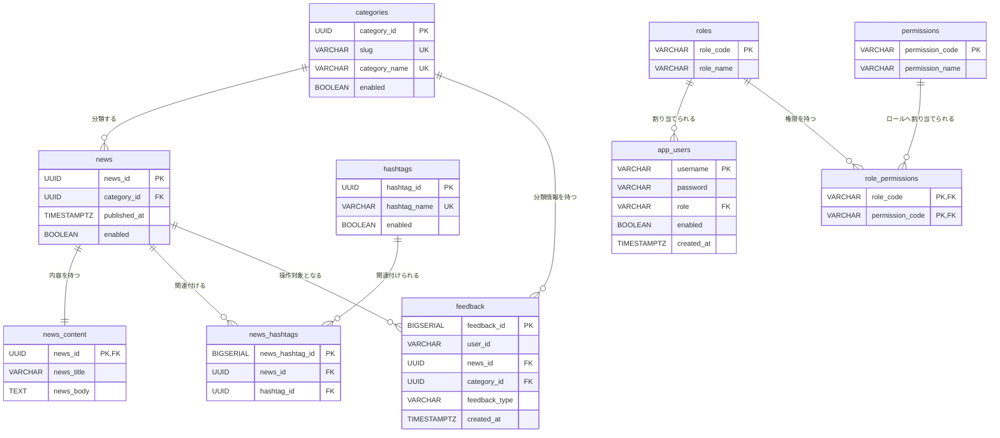

# SpringWebNews PostgreSQL設計

[\[ <u>目次へ戻る</u> \]](../../README.md#-設計-ファイル一式-)

---

 

## ● 設計内容

[**＜ 1 ＞ 文書概要**](#1-文書概要)

[**＜ 2 ＞ データ関連概要**](#2-データ関連概要)

[**＜ 3 ＞ テーブル一覧**](#3-テーブル一覧)

[**＜ 4 ＞ テーブル定義**](#4-テーブル定義)

[**＜ 5 ＞ 初期データ**](#5-初期データ)

[**＜ 6 ＞ データの有効・無効および削除方針**](#6-データの有効無効および削除方針)

 

―――――――――――――――――――――――――――――――

 

## 1. 文書概要

| 項目       | 内容                                                     |
|----------|--------------------------------------------------------|
| 文書名      | SpringWebNews PostgreSQL設計書                            |
| 対象システム   | SpringWebNews                                          |
| 対象データベース | PostgreSQL                                             |
| 目的       | PostgreSQLに保存するテーブル、カラム、制約、インデックス、初期データおよびデータ保持方針を定義する |

 

[\[ <u>▲ ページ上部へ</u> \]](#springwebnews-postgresql設計)

―――――――――――――――――――――――――――――――

 

## 2. データ関連概要

### 2.1 ER図

 

### 2.2 保存対象

| 保存先        | 保存するデータ                                    |
|------------|--------------------------------------------|
| PostgreSQL | カテゴリ、ニュース、ニュース内容、ハッシュタグ、フィードバック、利用者、ロール、権限 |

 

[\[ <u>▲ ページ上部へ</u> \]](#springwebnews-postgresql設計)

―――――――――――――――――――――――――――――――

 

## 3. テーブル一覧

| テーブル名              | 論理名           | 内容                       |
|--------------------|---------------|--------------------------|
| `categories`       | カテゴリ          | ニュースの分類を管理する             |
| `news`             | ニュース          | ニュースのカテゴリ、公開日時、有効状態を管理する |
| `news_content`     | ニュース内容        | ニュースのタイトルと本文を管理する        |
| `hashtags`         | ハッシュタグ        | ニュースに設定するハッシュタグを管理する     |
| `news_hashtags`    | ニュース・ハッシュタグ関連 | ニュースとハッシュタグの関連を管理する      |
| `feedback`         | フィードバック       | 利用者がニュースに対して行った操作を管理する   |
| `app_users`        | 利用者           | ログイン情報、ロール、有効状態を管理する     |
| `roles`            | ロール           | 利用者へ割り当てる役割を管理する         |
| `permissions`      | 権限            | システム内で利用できる機能を管理する       |
| `role_permissions` | ロール・権限関連      | ロールに割り当てる権限を管理する         |

 

[\[ <u>▲ ページ上部へ</u> \]](#springwebnews-postgresql設計)

―――――――――――――――――――――――――――――――

 

## 4. テーブル定義

### 4.1 カテゴリテーブル

#### 基本情報

| 項目    | 内容           |
|-------|--------------|
| テーブル名 | `categories` |
| 論理名   | カテゴリ         |
| 用途    | ニュースの分類を管理する |

 

#### カラム

| カラム名            | 型           | NULL | キー | 内容                  |
|-----------------|-------------|-----:|----|---------------------|
| `category_id`   | UUID        |   NO | PK | カテゴリを識別する ID        |
| `slug`          | VARCHAR(10) |   NO | UK | URL や内部処理で使用する短い識別名 |
| `category_name` | VARCHAR(10) |   NO | UK | 画面に表示するカテゴリ名        |
| `enabled`       | BOOLEAN     |   NO |    | カテゴリの有効状態           |

 

#### 制約・インデックス

| 項目        | 内容                         |
|-----------|----------------------------|
| 主キー       | カテゴリ ID を一意とする             |
| 識別名の一意性   | 同一の識別名を重複登録できない            |
| カテゴリ名の一意性 | 大文字・小文字を区別せず、同一名称を重複登録できない |
| 有効状態検索    | 有効なカテゴリを効率的に検索できるようにする     |

 

### 4.2 ニューステーブル

#### 基本情報

| 項目    | 内容                     |
|-------|------------------------|
| テーブル名 | `news`                 |
| 論理名   | ニュース                   |
| 用途    | ニュースの分類、公開日時、有効状態を管理する |

 

#### カラム

| カラム名           | 型           | NULL | キー | 内容              |
|----------------|-------------|-----:|----|-----------------|
| `news_id`      | UUID        |   NO | PK | ニュースを識別する ID    |
| `category_id`  | UUID        |   NO | FK | ニュースが属するカテゴリ ID |
| `published_at` | TIMESTAMPTZ |   NO |    | ニュースの公開日時       |
| `enabled`      | BOOLEAN     |   NO |    | ニュースの有効状態       |

 

#### 制約・インデックス

| 項目     | 内容                         |
|--------|----------------------------|
| 主キー    | ニュース ID を一意とする             |
| カテゴリ参照 | 登録済みのカテゴリのみ設定できる           |
| ニュース内容 | ニュース 1 件につきニュース内容を 1 件保持する |
| 公開日時検索 | 新しいニュースから取得できるようにする        |
| カテゴリ検索 | カテゴリ単位でニュースを検索できるようにする     |
| 有効状態検索 | 有効なニュースを効率的に検索できるようにする     |

 

### 4.3 ニュース内容テーブル

#### 基本情報

| 項目    | 内容                |
|-------|-------------------|
| テーブル名 | `news_content`    |
| 論理名   | ニュース内容            |
| 用途    | ニュースのタイトルと本文を管理する |

 

#### カラム

| カラム名         | 型           | NULL | キー    | 内容           |
|--------------|-------------|-----:|-------|--------------|
| `news_id`    | UUID        |   NO | PK・FK | 対象となるニュース ID |
| `news_title` | VARCHAR(20) |   NO |       | ニュースのタイトル    |
| `news_body`  | TEXT        |   NO |       | ニュースの本文      |

 

#### 制約

| 項目     | 内容                       |
|--------|--------------------------|
| 主キー    | ニュース ID を一意とする           |
| ニュース参照 | 登録済みのニュースのみ設定できる         |
| 関係     | ニュースとニュース内容は 1 対 1 とする   |
| 削除連動   | ニュースが削除された場合はニュース内容も削除する |

 

### 4.4 ハッシュタグテーブル

#### 基本情報

| 項目    | 内容                   |
|-------|----------------------|
| テーブル名 | `hashtags`           |
| 論理名   | ハッシュタグ               |
| 用途    | ニュースに設定するハッシュタグを管理する |

 

#### カラム

| カラム名           | 型           | NULL | キー | 内容             |
|----------------|-------------|-----:|----|----------------|
| `hashtag_id`   | UUID        |   NO | PK | ハッシュタグを識別する ID |
| `hashtag_name` | VARCHAR(10) |   NO | UK | ハッシュタグ名        |
| `enabled`      | BOOLEAN     |   NO |    | ハッシュタグの有効状態    |

 

#### 制約・インデックス

| 項目     | 内容                         |
|--------|----------------------------|
| 主キー    | ハッシュタグ ID を一意とする           |
| 名称の一意性 | 大文字・小文字を区別せず、同一名称を重複登録できない |
| 有効状態検索 | 有効なハッシュタグを効率的に検索できるようにする   |

 

### 4.5 ニュース・ハッシュタグ関連テーブル

#### 基本情報

| 項目    | 内容                  |
|-------|---------------------|
| テーブル名 | `news_hashtags`     |
| 論理名   | ニュース・ハッシュタグ関連       |
| 用途    | ニュースとハッシュタグの関連を管理する |

 

#### カラム

| カラム名              | 型         | NULL | キー | 内容            |
|-------------------|-----------|-----:|----|---------------|
| `news_hashtag_id` | BIGSERIAL |   NO | PK | 関連情報を識別するID   |
| `news_id`         | UUID      |   NO | FK | 対象となるニュースID   |
| `hashtag_id`      | UUID      |   NO | FK | 対象となるハッシュタグID |

 

#### 制約・インデックス

| 項目       | 内容                                  |
|----------|-------------------------------------|
| 主キー      | 関連 ID を一意とする                        |
| ニュース参照   | 登録済みのニュースのみ設定できる                    |
| ハッシュタグ参照 | 登録済みのハッシュタグのみ設定できる                  |
| 関連の一意性   | 同じニュースとハッシュタグの組み合わせを重複登録できない        |
| ニュース検索   | ニュース ID からハッシュタグを検索できるようにする         |
| ハッシュタグ検索 | ハッシュタグ ID からニュースを検索できるようにする         |
| 設定件数     | ニュース 1 件につき 1 件以上 5 件以下のハッシュタグを設定する |
| 有効状態     | 無効なハッシュタグをニュースへ設定できない               |
| 無効化制限    | ニュースに設定されているハッシュタグは無効化できない          |
| 削除連動     | ニュースまたはハッシュタグが削除された場合は関連情報も削除する     |

 

### 4.6 フィードバックテーブル

#### 基本情報

| 項目    | 内容                     |
|-------|------------------------|
| テーブル名 | `feedback`             |
| 論理名   | フィードバック                |
| 用途    | 利用者がニュースに対して行った操作を管理する |

 

#### カラム

| カラム名            | 型            | NULL | キー | 内容                  |
|-----------------|--------------|-----:|----|---------------------|
| `feedback_id`   | BIGSERIAL    |   NO | PK | フィードバックを識別するID      |
| `user_id`       | VARCHAR(128) |   NO |    | 操作した利用者ID           |
| `news_id`       | UUID         |   NO | FK | 操作対象のニュースID         |
| `category_id`   | UUID         |   NO | FK | 操作対象のニュースが属するカテゴリID |
| `feedback_type` | VARCHAR(32)  |   NO |    | 閲覧、お気に入り、評価等の操作種別   |
| `created_at`    | TIMESTAMPTZ  |   NO |    | 操作日時                |

 

#### フィードバック種別

| 種別      | 内容                 |
|---------|--------------------|
| 閲覧      | ニュースを表示した操作        |
| 選択      | ニュースを選択した操作        |
| お気に入り登録 | ニュースをお気に入りへ登録した操作  |
| お気に入り解除 | ニュースをお気に入りから解除した操作 |
| Good    | ニュースを肯定的に評価した操作    |
| Bad     | ニュースを否定的に評価した操作    |
| 評価解除    | 登録済みの評価を解除した操作     |

 

#### 制約・インデックス

| 項目     | 内容                                      |
|--------|-----------------------------------------|
| 主キー    | フィードバック ID を一意とする                       |
| ニュース参照 | 登録済みのニュースのみ設定できる                        |
| カテゴリ参照 | 登録済みのカテゴリのみ設定できる                        |
| 利用者別検索 | 利用者 ID と操作日時から履歴を検索できるようにする             |
| 記事別検索  | 利用者 ID、ニュース ID、操作種別、操作日時から履歴を検索できるようにする |

 

### 4.7 利用者テーブル

#### 基本情報

| 項目    | 内容                   |
|-------|----------------------|
| テーブル名 | `app_users`          |
| 論理名   | 利用者                  |
| 用途    | ログイン情報、ロール、有効状態を管理する |

 

#### カラム

| カラム名         | 型            | NULL | キー | 内容              |
|--------------|--------------|-----:|----|-----------------|
| `username`   | VARCHAR(128) |   NO | PK | ログインに使用する利用者 ID |
| `password`   | VARCHAR(200) |   NO |    | 暗号化したパスワード      |
| `role`       | VARCHAR(32)  |   NO | FK | 利用者へ割り当てるロール    |
| `enabled`    | BOOLEAN      |   NO |    | 利用者の有効状態        |
| `created_at` | TIMESTAMPTZ  |   NO |    | 利用者の登録日時        |

 

#### 制約・インデックス

| 項目    | 内容                                        |
|-------|-------------------------------------------|
| 主キー   | 利用者 ID を一意とする                             |
| ロール参照 | 登録済みのロールのみ設定できる                           |
| ロール検索 | ロール単位で利用者を検索できるようにする                      |
| 管理者保護 | システム管理者に必要な利用者を削除、無効化、名称変更、ロール変更できないようにする |

 

### 4.8 ロールテーブル

#### 基本情報

| 項目    | 内容               |
|-------|------------------|
| テーブル名 | `roles`          |
| 論理名   | ロール              |
| 用途    | 利用者へ割り当てる役割を管理する |

 

#### カラム

| カラム名        | 型           | NULL | キー | 内容          |
|-------------|-------------|-----:|----|-------------|
| `role_code` | VARCHAR(32) |   NO | PK | ロールを識別するコード |
| `role_name` | VARCHAR(64) |   NO |    | 画面に表示するロール名 |

 

#### 制約

| 項目  | 内容                |
|-----|-------------------|
| 主キー | ロールコードを一意とする      |
| 名称  | ロールの用途が分かる名称を設定する |

 

### 4.9 権限テーブル

#### 基本情報

| 項目    | 内容                 |
|-------|--------------------|
| テーブル名 | `permissions`      |
| 論理名   | 権限                 |
| 用途    | システム内で利用可能な機能を管理する |

 

#### カラム

| カラム名              | 型            | NULL | キー | 内容         |
|-------------------|--------------|-----:|----|------------|
| `permission_code` | VARCHAR(64)  |   NO | PK | 権限を識別するコード |
| `permission_name` | VARCHAR(128) |   NO |    | 画面に表示する権限名 |

 

#### 制約

| 項目  | 内容                 |
|-----|--------------------|
| 主キー | 権限コードを一意とする        |
| 名称  | 利用可能な操作が分かる名称を設定する |

 

### 4.10 ロール・権限関連テーブル

#### 基本情報

| 項目    | 内容                 |
|-------|--------------------|
| テーブル名 | `role_permissions` |
| 論理名   | ロール・権限関連           |
| 用途    | ロールごとに利用できる権限を管理する |

 

#### カラム

| カラム名              | 型           | NULL | キー    | 内容          |
|-------------------|-------------|-----:|-------|-------------|
| `role_code`       | VARCHAR(32) |   NO | PK・FK | 対象となるロールコード |
| `permission_code` | VARCHAR(64) |   NO | PK・FK | 対象となる権限コード  |

 

#### 制約・インデックス

| 項目    | 内容                         |
|-------|----------------------------|
| 主キー   | ロールコードと権限コードの組み合わせを一意とする   |
| ロール参照 | 登録済みのロールのみ設定できる            |
| 権限参照  | 登録済みの権限のみ設定できる             |
| ロール検索 | ロールに設定された権限を効率的に検索できるようにする |
| 削除連動  | ロールまたは権限が削除された場合は関連情報も削除する |

 

[\[ <u>▲ ページ上部へ</u> \]](#springwebnews-postgresql設計)

―――――――――――――――――――――――――――――――

 

## 5. 初期データ

### 5.1 ロール

| ロールコード      | ロール名     | 用途                    |
|-------------|----------|-----------------------|
| `ADMIN`     | 管理者      | すべての管理機能を利用する         |
| `USER_MGR`  | 利用者管理者   | 利用者の作成、状態変更、ロール変更を行う  |
| `MODEL_MGR` | 推薦モデル管理者 | 推薦モデルの再読込、登録、学習を行う    |
| `NEWS_MGR`  | ニュース管理者  | カテゴリ、ニュース、ハッシュタグを管理する |
| `DEMO`      | デモ利用者    | 推薦モデル管理機能の動作確認を行う     |
| `USER`      | 一般利用者    | ニュース参照、推薦、お気に入り等を利用する |

 

### 5.2 権限

| 権限コード                       | 権限名           |
|-----------------------------|---------------|
| `PASSWORD_CHANGE`           | 自分のパスワード変更    |
| `USER_CREATE`               | 利用者の新規作成      |
| `USER_ENABLE_DISABLE`       | 利用者の有効・無効変更   |
| `USER_ROLE_CHANGE`          | 利用者のロール変更     |
| `MODEL_RELOAD`              | 推薦モデルの再読込     |
| `MODEL_UPLOAD`              | 推薦モデルのアップロード  |
| `MODEL_TRAIN`               | 推薦モデルの学習      |
| `NEWS_CATEGORY_CREATE`      | カテゴリ作成        |
| `NEWS_ARTICLE_CREATE`       | ニュース作成        |
| `NEWS_CATEGORY_DISABLE`     | カテゴリの有効・無効変更  |
| `NEWS_ARTICLE_DISABLE`      | ニュースの有効・無効変更  |
| `NEWS_HASHTAG_MASTER`       | ハッシュタグ管理      |
| `NEWS_ARTICLE_HASHTAG_EDIT` | ニュースのハッシュタグ編集 |

 

### 5.3 ロール別権限

| ロール      | 付与する権限                                                                 |
|----------|------------------------------------------------------------------------|
| 管理者      | すべての権限                                                                 |
| 利用者管理者   | パスワード変更、利用者作成、利用者の有効・無効変更、利用者のロール変更                                    |
| 推薦モデル管理者 | パスワード変更、推薦モデル再読込、推薦モデルアップロード、推薦モデル学習                                   |
| ニュース管理者  | パスワード変更、カテゴリ作成、ニュース作成、カテゴリの有効・無効変更、ニュースの有効・無効変更、ハッシュタグ管理、ニュースのハッシュタグ編集 |
| デモ利用者    | 推薦モデル再読込、推薦モデルアップロード、推薦モデル学習                                           |
| 一般利用者    | パスワード変更                                                                |

 

### 5.4 カテゴリ

| 識別名       | カテゴリ名  |
|-----------|--------|
| `society` | 社会     |
| `tech`    | テクノロジー |
| `sports`  | スポーツ   |
| `ent`     | エンタメ   |
| `life`    | 暮らし    |

 

### 5.5 初期利用者

| 環境    | 内容                            |
|-------|-------------------------------|
| 開発環境  | 管理者、デモ利用者、一般利用者の動作確認用データを登録する |
| 本番環境  | 初期利用者データは登録しない                |
| パスワード | 暗号化した状態で保存する                  |

 

[\[ <u>▲ ページ上部へ</u> \]](#springwebnews-postgresql設計)

―――――――――――――――――――――――――――――――

 

## 6. データの有効・無効および削除方針

### 6.1 画面からの操作

| 対象            | 操作      | 内容                      |
|---------------|---------|-------------------------|
| カテゴリ          | 有効・無効変更 | 削除せず、有効状態を変更する          |
| ニュース          | 有効・無効変更 | 削除せず、有効状態を変更する          |
| ハッシュタグ        | 有効・無効変更 | 削除せず、有効状態を変更する          |
| 利用者           | 有効・無効変更 | 削除せず、有効状態を変更する          |
| フィードバック       | 操作なし    | 利用者の操作履歴として保持する         |
| ニュース内容        | 操作なし    | ニュースと合わせて管理する           |
| ニュース・ハッシュタグ関連 | 関連変更    | ニュースに設定するハッシュタグを追加・解除する |

 

### 6.2 有効状態による制御

| 対象     | 無効時の扱い                     |
|--------|----------------------------|
| カテゴリ   | 一般画面、API、ニュース作成時の選択肢に表示しない |
| ニュース   | 一般画面、API、推薦候補に表示しない        |
| ハッシュタグ | 新たにニュースへ設定できない             |
| 利用者    | ログインできない                   |

 

### 6.3 削除時のデータ整合性

| 対象            | 方針                               |
|---------------|----------------------------------|
| カテゴリ          | 通常は物理削除せず、無効状態で保持する              |
| ニュース          | 通常は物理削除せず、無効状態で保持する              |
| ハッシュタグ        | 通常は物理削除せず、無効状態で保持する              |
| 利用者           | 通常は物理削除せず、無効状態で保持する              |
| フィードバック       | 操作履歴および推薦データとして保持する              |
| ニュース内容        | ニュースが物理削除された場合は合わせて削除する          |
| ニュース・ハッシュタグ関連 | ニュースまたはハッシュタグが物理削除された場合は合わせて削除する |

 

### 6.4 管理者データの保護

| 項目       | 内容                         |
|----------|----------------------------|
| 管理者削除    | システム運用に必要な管理者は削除できない       |
| 管理者無効化   | システム運用に必要な管理者は無効化できない      |
| 管理者ロール変更 | システム運用に必要な管理者のロールは変更できない   |
| 管理者ID変更  | システム運用に必要な管理者の利用者IDは変更できない |

 

---

[\[ <u>▲ ページ上部へ</u> \]](#springwebnews-postgresql設計)

[\[ <u>目次へ戻る</u> \]](../../README.md#-設計-ファイル一式-)
